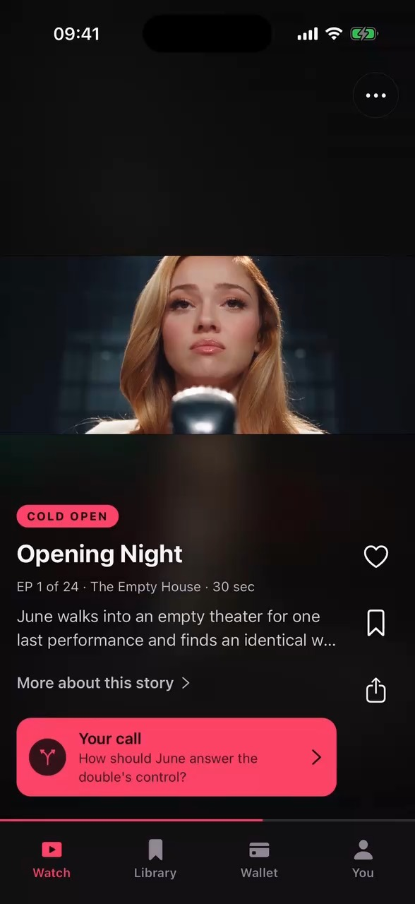

<div align="center">


# Dramatic

**The audience-directed short-drama platform. Watch the cliffhanger. Vote. The winning twist becomes tomorrow's episode.**

An open-source alternative to ReelShort and DramaBox — with one difference neither of them has: *the audience sits in the writers' room.*

[**▶ Try the live demo — the real app, in your browser**](https://dramatic-omega.vercel.app/#live)

[](https://dramatic-omega.vercel.app)
[](LICENSE)
[](https://github.com/Mukhsin0508/Dramatic/stargazers)
[](apps/mobile)
[](apps/web)
[](tsconfig.json)
[](#contributing)

<a href="https://dramatic-omega.vercel.app/#live">
  
</a>

*Every frame above is real, AI-generated series media produced through this repository's cost-capped pipeline.*

</div>

---

## Why Dramatic

Short vertical drama is exploding, but every platform ships the same one-way feed: binge, pay, repeat. Dramatic flips the loop:

- 🎬 **Cinematic vertical feed** — full-bleed portrait scenes, ambient letterboxing for widescreen shots, autoplaying stories, TikTok-grade paging.
- 🗳️ **The audience writes tomorrow** — every episode ends on a branching choice. The winning vote's `generationDirective` seeds the next episode's script.
- 🤖 **A real generation pipeline** — a provider-neutral job model bound to the official Higgsfield SDK, with cost estimates before submission, USD caps, durable downloads, and sanitized public receipts.
- 📖 **Continuity by contract** — every series is a validated JSON "series bible": characters, visual canon, outlined episodes, and vote branches, enforced with Zod schemas.
- 📱 **One codebase, three surfaces** — the same Expo app runs on iOS, Android, and — compiled with React Native Web — *inside the landing page itself.*

## Try it in 10 seconds

No install, no clone: **[dramatic-omega.vercel.app](https://dramatic-omega.vercel.app/#live)** embeds the actual app, compiled for the web. Scroll the feed, watch the generated episodes, cast a vote.

## Tonight's stories

| | | |
|:---:|:---:|:---:|
|  |  |  |
| **Opening Night**<br/>A singer meets the flawless replacement already wearing her face. | **Two Rings at the Funeral**<br/>Two widows follow a ringing phone into a conspiracy. | **Crown of Rust**<br/>A salvage diver wakes the last knight of a drowned kingdom. |
|  |  |  |
| **Midnight Ramen**<br/>A sealed letter connects three sleepless strangers to a missing woman. | **Neon Harvest**<br/>A rooftop farmer's impossible seed draws two dangerous visitors. | **The Last Alibi**<br/>A locked-courthouse murder mystery. |

Plus **Borrowed Vows** (a fake-wedding romance with a very real license) and **The Heir Upstairs** (a hidden heir inside a threatened apartment building). Five stories have playable generated media today; the rest show an honest coming-soon state.

## Quickstart

```bash
git clone https://github.com/Mukhsin0508/Dramatic.git
cd Dramatic
pnpm install
cp .env.example .env.local
pnpm dev
```

Focused commands:

```bash
pnpm dev:web       # Next.js landing + web demo at http://localhost:3000
pnpm dev:mobile    # Expo development server (dev build recommended over Expo Go)
```

**Prerequisites:** Node.js 24 LTS · pnpm 11.24 (pinned via `packageManager`) · for native builds, Xcode 26.4+ or Android Studio with API 36. On a physical phone, point `EXPO_PUBLIC_API_BASE_URL` at a LAN-reachable address.

### Everyday commands

```bash
pnpm build          # Build every workspace
pnpm lint           # Workspace linters
pnpm typecheck      # Strict TypeScript
pnpm test           # Unit and contract tests
pnpm check:content  # Validate every series bible and generated catalog
pnpm sync:content   # Regenerate typed story catalogs from series JSON
```

Before a pull request: `pnpm lint && pnpm typecheck && pnpm test && pnpm build`.

## Architecture

```text
apps/
  mobile/            Expo SDK 57 + Expo Router app (iOS, Android, and the embedded web demo)
  web/               Next.js 16 static landing page + server-only vendor facade
packages/
  contracts/         Zod schemas and types shared at every network boundary
  design-tokens/     Framework-neutral visual primitives
  higgsfield/        Server-only official SDK wrapper, safe job lifecycle, test doubles
series/              Validated story bibles, production scripts, generation receipts
scripts/             Catalog sync, cost-capped pilot generation, web demo export
```

Three rules keep the system honest:

1. **The mobile app never calls an AI vendor.** Generation goes through Dramatic's own API boundary ([`apps/web/src/lib/higgsfield.ts`](apps/web/src/lib/higgsfield.ts)); provider credentials stay on the server, and provider payloads are mapped into the neutral `GenerationJob` contract before they reach any client.
2. **Generation is an asynchronous job.** Create a job, get a stable ID, poll or verify a webhook. Production implementations persist jobs, process webhooks idempotently, and copy expiring provider outputs to durable storage.
3. **Content is data, not code.** Adding a series means adding `series/<slug>.json` and artwork, then `pnpm sync:content`. `SeriesBibleSchema` enforces character identity, sequential episodes, vote branches, generation directives, and visual continuity. See [`series/README.md`](series/README.md).

## The generation pipeline

The checked-in pilot generator turns a series bible into real media: a 720p 9:16 Soul keyframe, then an allowlisted image-to-video tier (DoP `lite`/`turbo`/`standard` or Seedance Fast). Every run:

- **estimates cost before submitting** and enforces a summed USD cap (`HIGGSFIELD_MAX_USD`, default $5),
- saves accepted request handles immediately and downloads finished output durably,
- writes a **sanitized public receipt** — no provider URLs, no request IDs,
- takes a per-episode lock and records an endpoint/input fingerprint so an ambiguous crash can never double-submit.

```bash
pnpm generate:pilot -- --slug two-rings-at-the-funeral --episode 1
```

<details>
<summary><strong>More: tiers, publishing rules, and crash recovery</strong></summary>

Use `--poster-only` to stop after key art, or `--reuse-poster` to animate an existing local poster. Clips default to `--clip-tier lite`; `turbo`, `standard`, and `seedance-fast` are also allowlisted, each with its own endpoint-bound request, estimate, ambiguity checkpoint, and durable variant file. A completed tier never replaces the active app clip automatically — promoting requires `--publish-clip`, and replacing different published bytes requires `--publish-clip --replace-published-clip`, so a late result from an older tier cannot silently win.

Generation POSTs have no provider-side idempotency, so the tool writes a private fingerprint under `.dramatic/generation` before dispatch. If a process dies mid-submission, later runs refuse to resubmit. Recover with the original response values:

```bash
pnpm generate:pilot -- --slug two-rings-at-the-funeral --episode 1 \
  --recover-operation poster \
  --request-id 00000000-0000-4000-8000-000000000000 \
  --status-url https://platform.higgsfield.ai/requests/00000000-0000-4000-8000-000000000000/status \
  --cancel-url https://platform.higgsfield.ai/requests/00000000-0000-4000-8000-000000000000/cancel
```

Only after the provider account confirms nothing was created, clear the guard with `--confirm-not-submitted poster` (or the selected clip operation). Stale `.lock` files are never removed automatically. Production credentials come from [Higgsfield Cloud](https://cloud.higgsfield.ai/api-keys); development-dashboard keys are rejected by the production API.

</details>

### Environment

| Variable | Visibility | Purpose |
| --- | --- | --- |
| `NEXT_PUBLIC_SITE_URL` | public | Canonical web origin |
| `NEXT_PUBLIC_GITHUB_REPOSITORY_URL` | public | Repository CTA and star-count source |
| `EXPO_PUBLIC_API_BASE_URL` | public | Native app's Dramatic API base URL |
| `HIGGSFIELD_API_KEY` | **secret** | Server-side `KEY_ID:KEY_SECRET` credential |
| `HIGGSFIELD_API_BASE_URL` | server | Provider origin (`https://dev-api.higgsfield.com` for dev keys) |
| `HIGGSFIELD_MAX_USD` | server | Cost cap before pilot submission (default `5`) |

Anything prefixed `EXPO_PUBLIC_` or `NEXT_PUBLIC_` is embedded in a client bundle — never put a secret there.

## Deployment

**Web (Vercel):** the landing page is a fully static Next.js export. `pnpm --filter @dramatic/web build` syncs content, compiles the Expo app to web (staged at `/app` for the embedded live demo), and exports the site. Deploy with `vercel build` + `vercel deploy --prebuilt` from `apps/web`, or connect the repository with **Root Directory** set to `apps/web`.

**Mobile (Expo/EAS):** run native commands from `apps/mobile`. `eas.json` ships matching development, preview, and production profiles; production build numbers are managed remotely; `expo-dev-client` powers development builds. EAS secrets and provider credentials must never use the `EXPO_PUBLIC_` prefix.

## Status & roadmap

Shipped and honest today:

- [x] Cinematic vertical watch feed with generated media, votes, library, and persistent on-device state
- [x] Cost-capped, crash-safe Higgsfield generation with sanitized receipts
- [x] Series-bible content system with schema-enforced continuity
- [x] Live in-browser demo of the real app, embedded on the landing page

On the road to production:

- [ ] Application backend: durable vote tallies, cross-device accounts, server-driven publishing
- [ ] Full episode assembly: multi-shot, dialogue, subtitles, sound design, QC
- [ ] Durable object storage/CDN for generated media and webhook-driven job state
- [ ] RevenueCat/Stripe entitlements behind the wallet and paywall previews
- [ ] Moderation, analytics, and rate limiting

The app never overstates what exists: previews are labeled by real runtime, coming-soon states are explicit, and the paywall does not simulate purchases.

## Contributing

Issues and pull requests are welcome. Keep changes inside the boundaries above (contracts at the edges, no provider types in client code, content as data), and run `pnpm lint && pnpm typecheck && pnpm test && pnpm build` before opening a PR. If you're adding a series, `pnpm check:content` must pass — the schema is the review.

## License

[MIT](LICENSE) © [Mukhsin Mukhtorov](https://github.com/Mukhsin0508)
